# Top 12 Residential Proxy Services Ranked in 2025 (Latest Compilation)

Finding the right residential proxy feels like navigating a maze blindfolded. You need reliable connections that won't get flagged, speeds that actually work for your projects, and pricing that doesn't drain your budget dry. After digging through dozens of providers, testing real-world performance, and comparing what's actually available, here are twelve residential proxy services that deliver results without the usual headaches.

## **[Geonode](https://geonode.com)**

Premium residential proxies designed for speed and reliability at accessible prices.

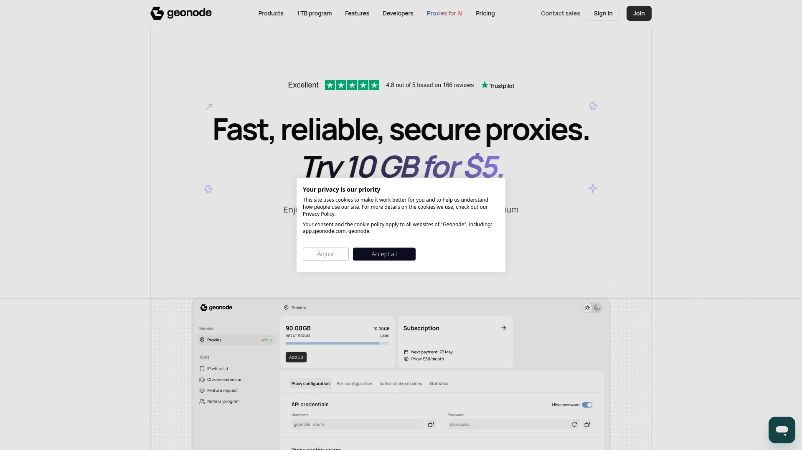

Geonode brings together fast response times—averaging 500ms—with a 99% success rate across their residential proxy network. The service gives you access to millions of unique IPs spanning 190+ countries, letting you target specific regions without jumping through hoops.

What stands out here is straightforward pricing that starts at just $5 for 10GB. You're getting genuine residential IPs sourced through ethical channels, not recycled datacenter addresses dressed up as something they're not. The platform supports both HTTP and SOCKS5 protocols, handles unlimited concurrent connections, and maintains 99.99% uptime so your projects keep running.

Setting up takes minutes thanks to their proxy configuration tool. No wrestling with complicated documentation or waiting days for support to respond. The dashboard shows real-time statistics, bandwidth usage, and connection quality—everything visible at a glance. Whether you're scraping product data, managing multiple accounts, or testing localized content, Geonode's infrastructure scales with your needs without requiring a complete reconfiguration every time.

## **[IPRoyal](https://iproyal.com)**

Affordable rotating and static residential proxies with flexible pricing models.

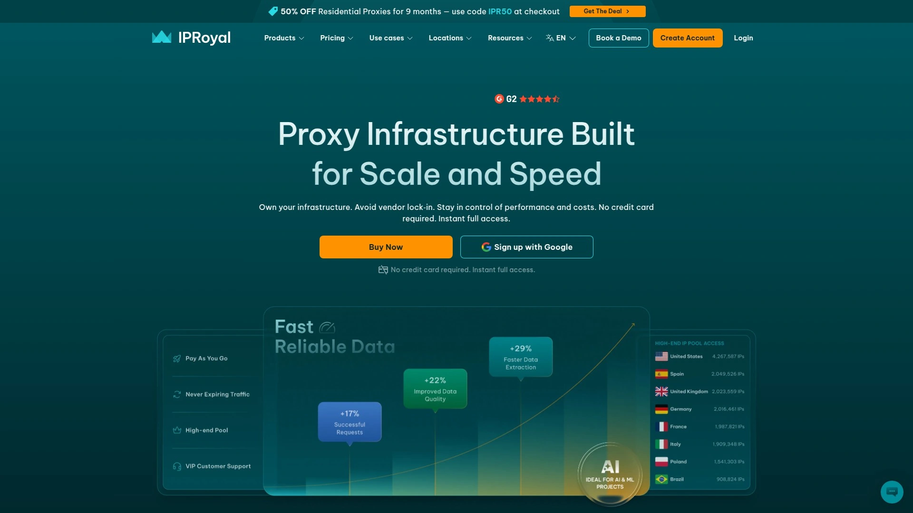

IPRoyal operates a network of over 32 million residential IPs across 195 countries. Their residential proxies start at $1.75 per GB with traffic that never expires—buy it once, use it whenever. This pay-as-you-go model means you're not locked into monthly subscriptions or watching unused bandwidth disappear.

The service supports both rotating proxies and static sessions lasting up to seven days. City and state targeting lets you narrow down to specific locations, useful when you need precise geographic data. Authentication works through username/password or IP whitelisting, and both HTTP(S) and SOCKS5 protocols are supported.

IPRoyal maintains 99.7% success rates with dedicated IPs for each user. No sharing means better performance and fewer blocks. Their 24/7 support team responds quickly through live chat, and the platform integrates with over 650 tools right out of the box. Setup takes minutes, replacement IPs are available when needed, and the straightforward dashboard makes proxy management simple.

## **[Bright Data](https://brightdata.com)**

Enterprise-grade proxy network with extensive features and global coverage.

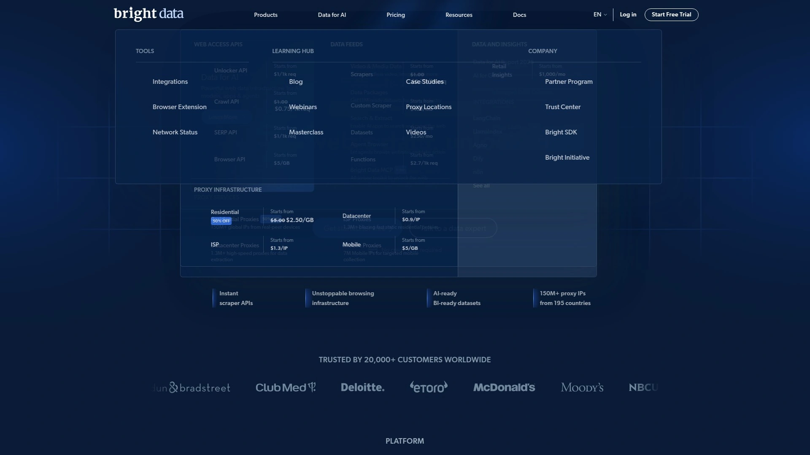

Bright Data controls over 150 million residential IPs across 195 countries—one of the largest pools available. The network delivers 99.95% success rates with response times around 0.7 seconds, backed by unlimited concurrent connections and 99.99% uptime guarantees.

What makes Bright Data distinctive is precision targeting down to ZIP code and ASN levels, included at no extra charge. The QUIC protocol support delivers faster speeds than standard HTTP/S connections. Sticky and rotating sessions adapt to different use cases, from quick scraping tasks to extended browsing sessions.

The platform includes comprehensive tools: a proxy manager application, browser extensions, public API access, and integration guides for third-party software. Pricing starts at $8.4 per GB on pay-as-you-go plans, with monthly subscriptions reducing costs for higher volumes. KYC verification and strict compliance measures ensure legitimate use only.

## **[Oxylabs](https://oxylabs.io)**

High-performance residential proxies built for demanding enterprise applications.

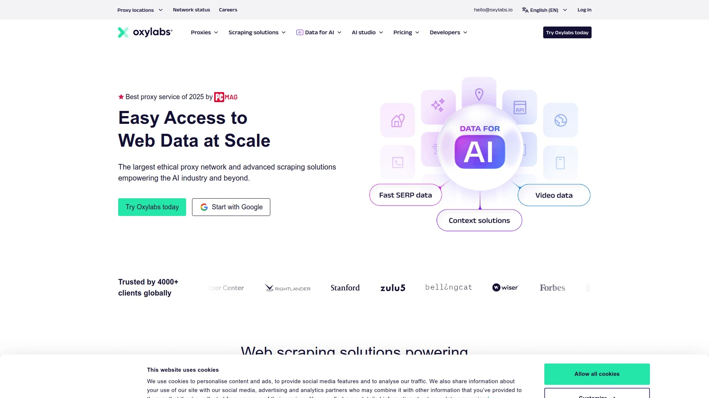

Oxylabs provides access to over 100 million residential IPs spanning 195 countries. The network achieves 99.82% success rates with 0.89-second response times, powered by ISO 27001-certified infrastructure that meets enterprise security requirements.

Free geo-targeting includes country, city, state, ZIP code, ASN, and even specific coordinates. The QUIC protocol implementation delivers 0.41-second response times—among the fastest available. Sessions support unlimited duration, and automatic IP rotation minimizes detection risks.

Integration happens through a single endpoint setup rather than managing long proxy lists. The service supports HTTP, HTTPS, SOCKS5, UDP, and TCP protocols. Pricing begins at $4 per GB on pay-as-you-go plans, with monthly packages offering volume discounts. Enterprise features include dedicated account managers, technology E&O insurance, and 24/7 technical support.

## **[Decodo (formerly Smartproxy)](https://decodo.com)**

Best value residential proxies with reliable performance and competitive pricing.

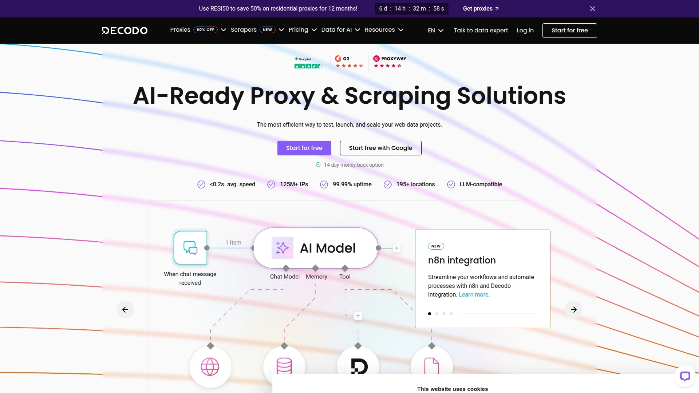

Decodo manages 125 million residential and mobile IPs across 195+ locations globally. The network maintains 99.86% success rates with 0.63-second response times—enterprise-grade performance at mid-market pricing starting from $7.5 per GB.

Sessions last up to 24 hours with both rotating and sticky options. City-level targeting works across most major locations, and the platform supports HTTP, HTTPS, and SOCKS5 protocols (including UDP). Unlimited concurrent connections mean your projects scale without hitting artificial limits.

The dashboard simplifies proxy management with real-time usage stats, easy configuration, and sub-user controls. Integration works through country endpoints or a backconnect gateway depending on your setup needs. A 14-day money-back guarantee and 24/7 support make testing risk-free. The Site Unblocker add-on tackles complex anti-bot systems for tougher scraping challenges.

## **[SOAX](https://soax.com)**

Fast residential proxies with granular targeting and high success rates.

SOAX operates 155 million residential IPs with mobile proxies adding another 33 million addresses across 195+ locations. Recent infrastructure upgrades reduced latency by 64%, making it one of the fastest options for North American connections.

Success rates hit 99.95% with 0.55-second average response times. Targeting goes down to country, city, and ISP levels—you can even select specific mobile carriers. Sessions last up to 24 hours, and rotation happens per request or based on time intervals you define.

The platform uses proprietary infrastructure and first-party sourcing rather than reselling third-party pools. This approach delivers higher performance and better stability. AI-powered smart rotation automatically selects optimal IPs based on your target domain and request history. Pricing starts at $4 per GB with flexible monthly plans.

## **[Infatica](https://infatica.io)**

Ethically sourced residential proxies with competitive rates and solid performance.

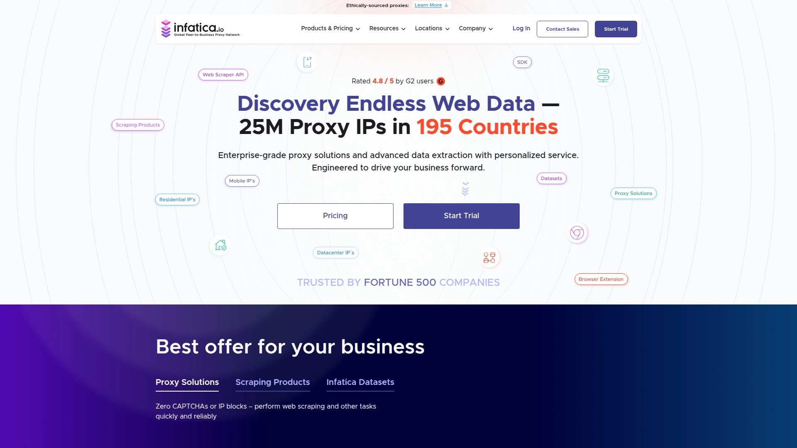

Infatica provides access to 15 million residential IPs globally, sourced entirely through explicit user consent. Independent testing shows 94.30% success rates for residential connections with industry-leading 0.32-second response times in key markets like the UK.

The network supports targeting by country, state, city, ASN, and ZIP code—filters you can combine for precise location control. Sessions last anywhere from 5 to 60 minutes, or you can establish sticky sessions without rotation intervals. Both HTTP(S) and SOCKS5 protocols work, though UDP isn't supported.

Gateway servers in the US, Asia, and Europe route traffic automatically to the closest connection point. Integration happens through generated proxy lists or API tools that add parameters to usernames. Pricing recently dropped 50% to $4 per GB, making it more competitive while maintaining quality standards.

## **[NetNut](https://netnut.io)**

Direct ISP connectivity delivering datacenter speeds with residential anonymity.

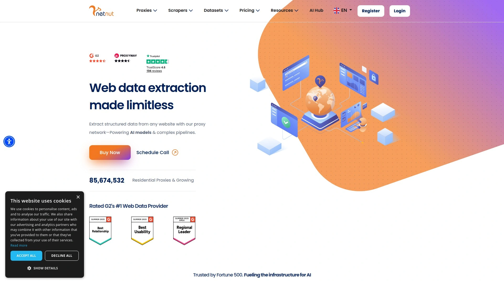

NetNut connects directly to ISPs rather than routing through peer-to-peer networks, eliminating traffic bottlenecks that slow down other providers. The network includes 85 million residential IPs covering over 195 countries, with 98-99% success rates and 1.0-second response times.

One-hop architecture means traffic routes exclusively through NetNut's infrastructure—no third-party devices in the chain. This approach delivers fewer disconnections and more stable connections. Country, state, city, and ASN targeting works across all locations, and sessions last until IPs go offline or up to one hour for long sessions.

The network supports HTTP, HTTPS, and SOCKS5 protocols with unlimited concurrent connections. Gateway servers sit at major internet routes and ISP connectivity points under complete NetNut control. Pricing starts at $3.53 per GB with a 7-day trial available for companies.

## **[ProxyEmpire](https://proxyempire.io)**

Precise geo-targeting with a focus on local data collection needs.

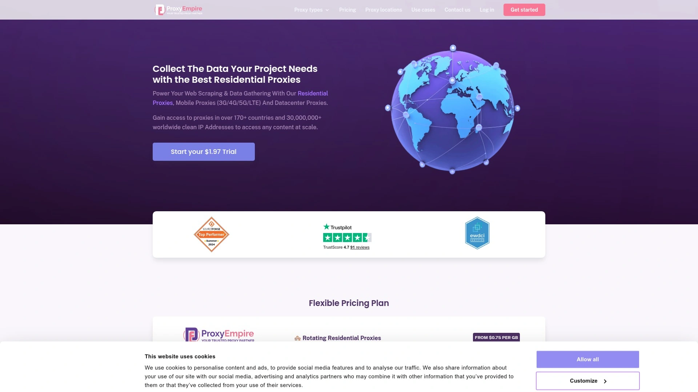

ProxyEmpire offers over 30 million rotating residential proxies with coverage across 170+ countries. Despite modest advertised numbers, independent testing found over 350,000 unique IPs in the US alone—performance rivaling larger competitors.

Advanced filtering lets you target countries, regions, cities, and specific ISPs. This precision matters when collecting localized data or testing geo-specific content. Sessions work as rotating or sticky depending on your requirements, and 99.9% uptime backs the infrastructure.

Response times average 0.6 seconds, and the network supports HTTP, HTTPS, and SOCKS5 protocols. The dashboard includes a built-in proxy manager for organizing addresses by purpose or region. VIP integration support helps new users get configured quickly. Pricing starts at $3 per GB with $1.97 trial options.

## **[Webshare](https://webshare.io)**

Simple residential proxies with transparent pricing and high uptime.

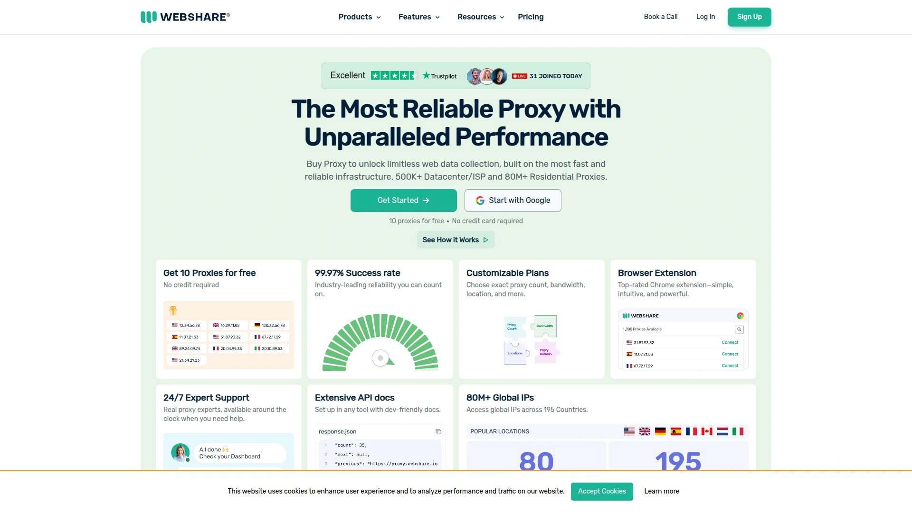

Webshare provides over 30 million ethically sourced residential IPs across 195 locations with 99.7% uptime. The network supports HTTP and SOCKS5 protocols, offering flexibility for different scraping and automation tasks.

Country-level targeting works across the entire pool, though city selection isn't available. Sessions rotate per request or maintain sticky connections as needed. Unlimited bandwidth means you're not watching usage counters or paying overage fees on most plans.

The platform emphasizes ease of use—download proxy lists directly or integrate via API for automation. Free plans include 1GB monthly bandwidth for testing, and paid residential proxies start at $1.75 per GB. The straightforward dashboard handles configuration, monitoring, and list management without unnecessary complexity.

## **[Rayobyte](https://rayobyte.com)**

Budget-friendly rotating proxies with non-expiring traffic benefits.

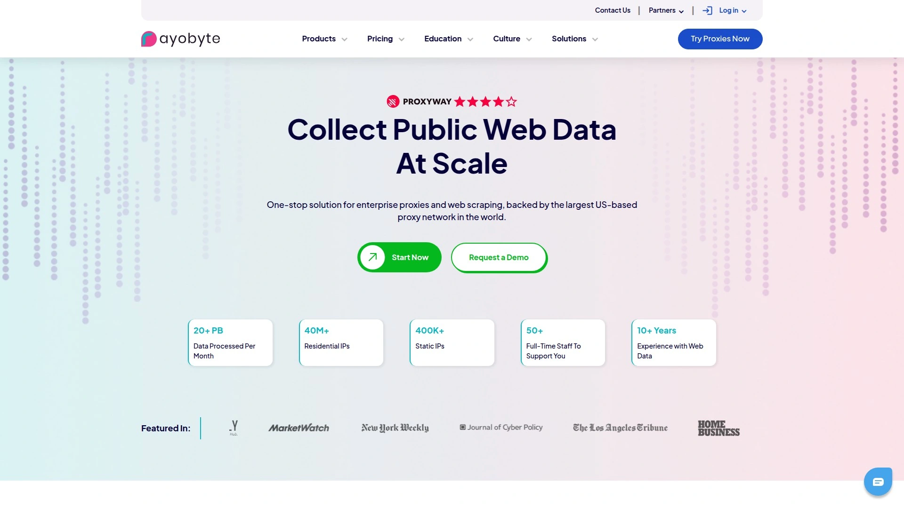

Rayobyte maintains a pool of over 40 million residential IPs spanning 150 countries with 99.1% success rates. The standout feature? Traffic never expires—buy bandwidth once and use it whenever you need it, making bulk purchases extremely cost-effective.

Pricing starts at just $0.90 per GB, among the lowest in the market. Targeting works at country, state, and city levels, and sessions last up to 120 minutes. Both rotating and sticky options adapt to different project requirements, with HTTP(S) and SOCKS5 protocol support.

The Cash Raven sourcing program provides transparency about IP acquisition—all addresses come from users who voluntarily participate. While response times run slower than premium providers, the service handles basic scraping and automation tasks reliably. Setup takes minutes, and integration works with major web scraping tools.

## **[DataImpulse](https://dataimpulse.com)**

Ethically sourced proxies with excellent response times and simple pricing.

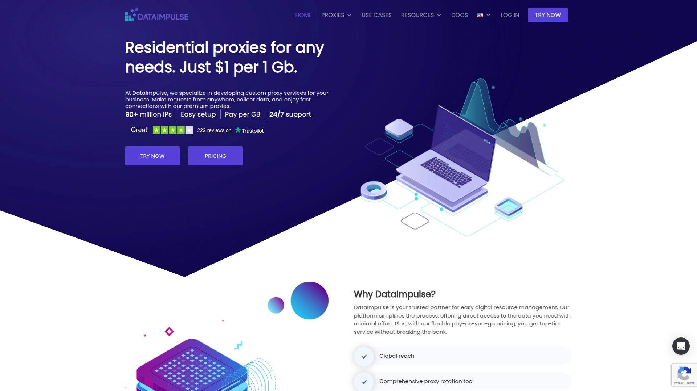

DataImpulse operates 15+ million ethically sourced IPs across 194 locations, with all addresses obtained through clear user consent. Independent testing achieved 94.20% success rates for mobile proxies and consistent one-second response times.

Targeting options include country, state, city, ZIP code, and ASN—filters you can combine or use separately. Sessions last up to 120 minutes, giving plenty of time for multi-step sequences. HTTP(S) and SOCKS5 protocols (with UDP support) work with the network's 2,000 concurrent thread limit.

The platform launched in late 2022 but quickly built credibility through first-party IP pools and transparent operations. Pricing starts at $1 per GB—among the most affordable options—with no expiration dates on purchased traffic. The anonymous filter toggle removes less-reliable IPs, and host blocking conserves bandwidth by filtering ads.

## FAQ

**What response times should I expect from residential proxies?**

Quality residential proxies typically deliver response times between 0.3 and 2 seconds depending on location and provider infrastructure. Geonode averages 500ms, making it suitable for time-sensitive scraping tasks. Faster isn't always better—extremely quick responses sometimes indicate datacenter IPs misrepresented as residential addresses.

**How does traffic expiration affect proxy costs?**

Some providers like Geonode, IPRoyal, and Rayobyte offer traffic that never expires, letting you buy in bulk and use bandwidth over months without waste. Others expire unused data monthly. For consistent usage, monthly plans often cost less per GB. For sporadic projects, non-expiring traffic prevents paying for bandwidth you don't use.

**Can residential proxies bypass CAPTCHAs automatically?**

Residential proxies significantly reduce CAPTCHA encounters because requests appear to come from real household connections rather than data centers. However, suspicious patterns—rapid requests, repeated actions, inconsistent fingerprints—still trigger challenges. Pairing residential IPs with proper session management and realistic behavior patterns delivers the best results.

## Conclusion

The residential proxy landscape keeps evolving, but a few things stay constant: you need reliable connections, genuine IP addresses, and pricing that makes sense for your projects. These twelve services deliver on those basics while offering different strengths depending on what you're building.

**[Geonode](https://geonode.com)** hits the sweet spot for most use cases—fast response times, solid success rates, and straightforward pricing starting at just $5 for 10GB. Whether you're scraping product data, managing accounts across platforms, or testing localized content, the combination of 99% success rates and 500ms response times handles everyday tasks without the premium price tags. The ethical sourcing, comprehensive country coverage, and simple setup make it practical for both new projects and scaling existing operations.
